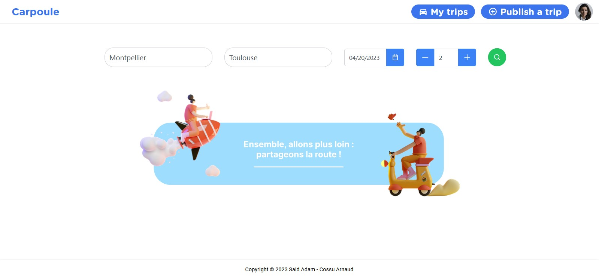
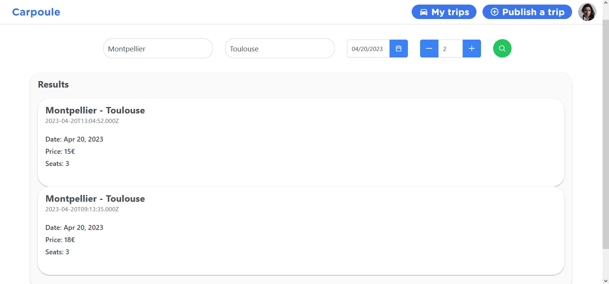
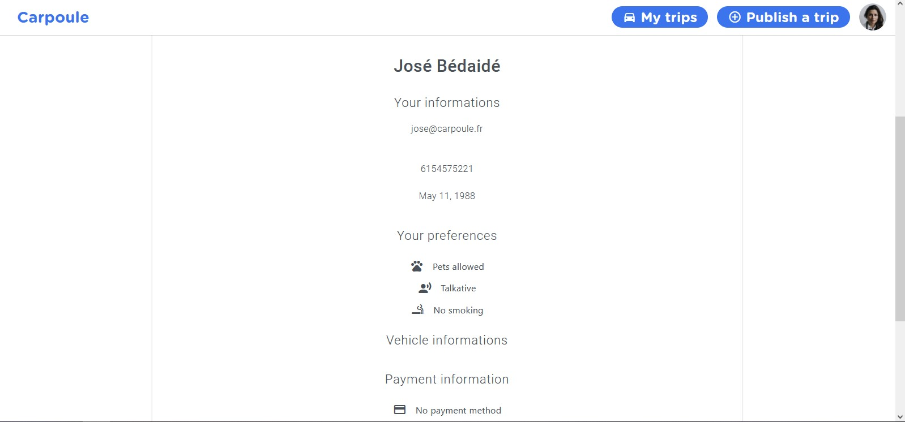
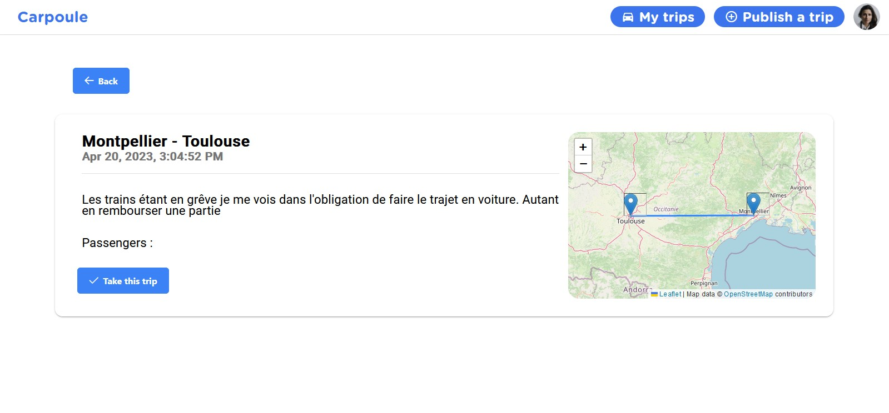

# HAI806I-Carpool-project

Ce projet basé sur un stack MEAN (MongoDB Express, Angular et NodeJS) permet la mise en place d'un système de covoiturage pour mettre en relation conducteurs et voyageurs. Il permet toutes les fonctionnalités basique que l'on pourrait attendre d'une application comme celle-ci. Ce projet a été développé par [Adam SAID](https://github.com/Gaiko19) et [Arnaud Cossu](https://github.com/ArnaudCs) de l'Université de Montpellier pour l'UE HAI806I Architectures avancées du web.

Pour l'utilisez de votre côté merci de vous référer à la partie [Installation](#installation) !


- [HAI806I-Carpool-project](#hai806i-carpool-project)
  - [Fonctionnalités](#fonctionnalités)
  - [Installation](#installation)
    - [Pré-requis](#pré-requis)
    - [Serveur](#serveur)
    - [Client](#client)
    - [Base de données](#base-de-données)
  - [Demo](#demo)
    - [Comptes existants](#comptes-existants)
  - [Services et composants](#services-et-composants)
      - [Défaut](#défaut)
      - [Connexion](#connexion)
      - [Inscription](#inscription)
      - [Recherche](#recherche)
      - [Profile](#profile)
      - [Edition infos](#edition-infos)
      - [Edition mot de passe](#edition-mot-de-passe)
      - [Publier](#publier)
      - [Mes voyages](#mes-voyages)
      - [Covoiturage](#covoiturage)
  - [Base de données](#base-de-données-1)
      - [Covoiturages](#covoiturages)
      - [Utilisateurs](#utilisateurs)
  - [API](#api)
      - [Endpoint](#endpoint)
      - [Test connexion](#test-connexion)
      - [Récupérer tous les covoiturages](#récupérer-tous-les-covoiturages)
      - [Recherche de covoiturages par trajet](#recherche-de-covoiturages-par-trajet)
      - [Récupération des infos d'un covoiturage](#récupération-des-infos-dun-covoiturage)
      - [Recherche des passagers en attente d'acceptation dans un covoiturage](#recherche-des-passagers-en-attente-dacceptation-dans-un-covoiturage)
      - [Acceptation d'un passager dans un covoiturage](#acceptation-dun-passager-dans-un-covoiturage)
      - [Rejet d'un passager dans un covoiturage](#rejet-dun-passager-dans-un-covoiturage)
      - [Réservation d'un siège](#réservation-dun-siège)
      - [Suppression d'un covoiturage](#suppression-dun-covoiturage)
      - [Création d'un covoiturage](#création-dun-covoiturage)
      - [Création de compte](#création-de-compte)
      - [Connexion](#connexion-1)
      - [Récupération des infos du profile](#récupération-des-infos-du-profile)
      - [Modification du profile](#modification-du-profile)
      - [Modification du mot de passe](#modification-du-mot-de-passe)
      - [Récupération des infos pblique d'un utilisateur](#récupération-des-infos-pblique-dun-utilisateur)
      - [Récupération des voyages concernant un utilisateur](#récupération-des-voyages-concernant-un-utilisateur)
  - [Auteurs](#auteurs)


## Fonctionnalités

- Création de compte et authentification
- Changement d'informations du profile et mot de passe
- Création de covoiturage
- Recherche de covoiturage
- Système de réservation du covoiturage avec acceptation et rejet

## Installation

### Pré-requis
Afin d'uilisez ce projet sur votre machine récupérer tout le projet et installer chaque partie une à une en suivant les chapitres suivants. Il vous faut avoir sur votre machine :
- npm
- angular CLI
- node
- mongodb ou Atlas (voir la partie [Base de données](#base-de-données))

### Serveur

1. Récupérer le dossier SERVER présent dans l'archive.
2. Assurez-vous que le fichier db.ini est bien un niveau au dessus du dossier SERVER dans votre arborescence.
3. Naviguer dans le dossier SERVER
4. Installer les dépendances avec :
```bash
npm install
```
5. Lancer le serveur avec :
```bash
node server.js
```
6. Le serveur doit afficher : 
"Server listening on port 3000"

### Client

1. Récupérer le dossier CarPoule présent dans l'archive.
2. Naviguer dedans
3. Installer les dépendances avec :
```bash
npm install
```
4. Lancer le client avec :
```bash
ng serve -o
```

### Base de données
Une installation de MongoDB ou l'utilisation de Atlas est nécessaire pour une utilisation personelle du projet. Les fichiers étant fourni il ne vous reste plus qu'à les importer dans votre base de données avec une table nommée CarPoule et trois tables : carpool, user et pending. En suite, créez un fichier db.ini à la racine du projet avec le nom d'utilisateur et le mot de passe de connexion à la BDD, l'ACCES_TOKEN_SECRET pour le hashage des mot de passes et l'ACCESS_CONTROL_ALLOW_ORIGIN pour déterminer qui peut accéder au serveur. Une API_KEY peut être nécessaire pour calculer les coordonnées des villes si besoin.

Voici la structure du fichier db.ini :

```bash
username = user
password = pass
ACCESS_TOKEN_SECRET = 000
ACCESS_CONTROL_ALLOW_ORIGIN = http://localhost:4200
API_KEY = xxxxxx
```

## Demo

Pour tester le projet vous pouvez vous créer un compte ou utiliser un compte existant. Cela vous permet en suite de créer un covoiturage. Une fois le trajet créé, vous pouvez trouver tous les covoiturages vous concernants sur la page My Trips (dont vous êtes le conducteur ou un passager). Un conducteur ne peut réserver de places dans son propre covoiturage alors pour tester vous pouvez vous connecter à un autre compte afin de rechercher le covoiturage précédemment créé et faire un réservation. Une fois faite, retourner sur le compte qui a créé le covoiturage et allé sur votre trajet. Vous verrez alors la demande de réservation innitiée par l'autre utilisateur que vous pouvez alors refuser ou accepter. 

### Comptes existants 


| Email            | Mot de passe |
| :--------------- | :----------- |
| test@carpoule.fr | azert        |

Mais vous pouvez vous créer un nouveau compte.

## Services et composants
#### Défaut
```bash
http://localhost:4200/
```
Page d'accueil avec barre de recherche et barre de navigation


#### Connexion
```bash
http://localhost:4200/login
```
Page de connexion au compte perso

#### Inscription
```bash
http://localhost:4200/register
```
Page de création d'un nouveau compte

#### Recherche
```bash
http://localhost:4200/search?{departure}&{arrival}&{date}&{seats}
```
Page de recherche de covoiturage avec paramètres en GET optionnels. Permet de renvoyer vers des covoiturages en cas de résultats.




#### Profile
```bash
http://localhost:4200/profile
```
Page d'informations du compte connecté permettant également de renvoyer vers les pages de modification du mot de passe et des informations.



#### Edition infos
```bash
http://localhost:4200/profile/edit
```
Page de modification des informations du compte connecté.

#### Edition mot de passe
```bash
http://localhost:4200/profile/password
```
Page de modification du mot de passe du compte connecté.

#### Publier
```bash
http://localhost:4200/publish
```
Page de publication d'un nouveau covoiturage.

#### Mes voyages
```bash
http://localhost:4200/trips
```
Page permettant à un utilisateur de voir tous les covoiturages dont il est passager ou conducteur et de le renvoyer vers un covoiturage en particulier.

#### Covoiturage
```bash
http://localhost:4200/carpool/:id
```
Page dynamique d'un covoiturage, récupéré en fonction de l'ID fourni dans l'URL. Permet de voir les détails d'un covoiturage avec en plus le composant de carte. Permet également à un utilisateur (différent du conducteur) de réserver une place et au conducteur de gérer les demandes de réservation.




## Base de données
Vous pouvez retrouver des dump de la base de données dans les fichiers suivants 

#### Covoiturages
[-> carpool.json](DATABASE/carpool.json)

#### Utilisateurs
[-> users.json](DATABASE/users.json)

## API
#### Endpoint
```bash
http://localhost:3000/
```
#### Test connexion

```http
  GET /
```

#### Récupérer tous les covoiturages

```http
  GET /search
```

| Parameter | Type | Description |
| :-------- | :--- | :---------- |
| `none`    | -    | -           |

#### Recherche de covoiturages par trajet

```http
  GET /search/${departure}/${arrival}&date=${date}&seat=${seat}
```

| Parameter   | Type     | Description                                 |
| :---------- | :------- | :------------------------------------------ |
| `departure` | `string` | Ville de France avec majuscule              |
| `arrival`   | `string` | Ville de France avec majuscule              |
| `arrival`   | `string` | Ville de France avec majuscule              |
| `date`      | `Date`   | [OPTIONAL] Date de départ format yyyy-mm-dd |
| `seat`      | `int`    | [OPTIONAL] Nombre de places nécessaires     |

#### Récupération des infos d'un covoiturage

```http
  GET /carpool/${id}
```

| Parameter | Type     | Description                  |
| :-------- | :------- | :--------------------------- |
| `id`      | `string` | Identifiant d'un covoiturage |


#### Recherche des passagers en attente d'acceptation dans un covoiturage

```http
  GET /pending/${id}
```

| Parameter | Type     | Description                  |
| :-------- | :------- | :--------------------------- |
| `auth`    | `cookie` | Cookie d'authentification    |
| `id`      | `string` | Identifiant d'un covoiturage |


#### Acceptation d'un passager dans un covoiturage

```http
  POST /pending/accept
```

| Parameter      | Type     | Description                  |
| :------------- | :------- | :--------------------------- |
| `auth`         | `cookie` | Cookie d'authentification    |
| `carpool_id`   | `string` | Identifiant d'un covoiturage |
| `passenger_id` | `string` | Identifiant d'un passager    |

#### Rejet d'un passager dans un covoiturage

```http
  POST /pending/reject
```

| Parameter      | Type     | Description                  |
| :------------- | :------- | :--------------------------- |
| `auth`         | `cookie` | Cookie d'authentification    |
| `carpool_id`   | `string` | Identifiant d'un covoiturage |
| `passenger_id` | `string` | Identifiant d'un passager    |


#### Réservation d'un siège

```http
  POST /carpool/${id}/book
```

| Parameter | Type     | Description                  |
| :-------- | :------- | :--------------------------- |
| `auth`    | `cookie` | Cookie d'authentification    |
| `id`      | `string` | Identifiant d'un covoiturage |

#### Suppression d'un covoiturage

```http
  DELETE /carpool/${id}
```

| Parameter | Type     | Description                  |
| :-------- | :------- | :--------------------------- |
| `auth`    | `cookie` | Cookie d'authentification    |
| `id`      | `string` | Identifiant d'un covoiturage |

#### Création d'un covoiturage

```http
  POST /publish
```

| Parameter     | Type      | Description                                   |
| :------------ | :-------- | :-------------------------------------------- |
| `auth`        | `cookie`  | Cookie d'authentification                     |
| `departure`   | `string`  | Ville de France de départ avec majuscule      |
| `arrival`     | `string`  | Ville de France d'arrivé avec majuscule       |
| `date`        | `Date`    | Date format yyyy-mm-dd                        |
| `seats`       | `int`     | Nombre de sièges disponibles                  |
| `highway`     | `boolean` | true si utilisation d'autoroutes, false sinon |
| `price`       | `float`   | Prix du trajet                                |
| `description` | `string`  | Description du trajet                         |

#### Création de compte

```http
  POST /signup
```

| Parameter      | Type      | Description                                      |
| :------------- | :-------- | :----------------------------------------------- |
| `email`        | `string`  | Email de l'utilisateur                           |
| `password`     | `string`  | Mot de passe                                     |
| `name`         | `string`  | Nom                                              |
| `firstname`    | `string`  | Prénom                                           |
| `birthdate`    | `Date`    | Date de naissance format yyyy-mm-dd              |
| `pref_smoking` | `boolean` | true si pas dérangé par la fumée, false sinon    |
| `pref_animals` | `boolean` | true si pas dérangé par les animaux, false sinon |
| `pref_talk`    | `boolean` | true si pas dérangé pour discuter, false sinon   |
| `phone`        | `string`  | Numéro de téléphone                              |


#### Connexion

```http
  POST /login
```

| Parameter  | Type     | Description  |
| :--------- | :------- | :----------- |
| `email`    | `string` | Email        |
| `password` | `string` | Mot de passe |

#### Récupération des infos du profile

```http
  GET /profile
```

| Parameter | Type     | Description               |
| :-------- | :------- | :------------------------ |
| `auth`    | `cookie` | Cookie d'authentification |


#### Modification du profile

```http
  POST /profile/edit
```

| Parameter      | Type      | Description                                      |
| :------------- | :-------- | :----------------------------------------------- |
| `auth`         | `cookie`  | Cookie d'authentification                        |
| `email`        | `string`  | Email de l'utilisateur                           |
| `name`         | `string`  | Nom                                              |
| `firstname`    | `string`  | Prénom                                           |
| `birthdate`    | `Date`    | Date de naissance format yyyy-mm-dd              |
| `pref_smoking` | `boolean` | true si pas dérangé par la fumée, false sinon    |
| `pref_animals` | `boolean` | true si pas dérangé par les animaux, false sinon |
| `pref_talk`    | `boolean` | true si pas dérangé pour discuter, false sinon   |
| `phone`        | `string`  | Numéro de téléphone                              |
| `brand`        | `string`  | Marque du véhicule                               |
| `model`        | `string`  | Modèle du véhicule                               |
| `color`        | `string`  | Couleur du véhicule format "#xxxxx"              |
| `registration` | `string`  | Immatriculation du véhicule                      |
| `card_num`     | `string`  | Numéro de la carte de crédit                     |
| `card_cvc`     | `string`  | CVC de la carte                                  |
| `card_exp`     | `Date`    | Date d'expiration de la carte format yyyy-mm-dd  |

#### Modification du mot de passe

```http
  POST /profile/password
```

| Parameter      | Type     | Description               |
| :------------- | :------- | :------------------------ |
| `auth`         | `cookie` | Cookie d'authentification |
| `password`     | `string` | Mot de passe actuel       |
| `new_password` | `string` | Nouveau mot de passe      |


#### Récupération des infos pblique d'un utilisateur

```http
  POST /usersimple
```

| Parameter | Type              | Description                                       |
| :-------- | :---------------- | :------------------------------------------------ |
| `auth`    | `cookie`          | Cookie d'authentification                         |
| `ids`     | `Array of string` | Tableau avec les ids des utilisateurs à récupérer |

#### Récupération des voyages concernant un utilisateur

```http
  GET /trips
```

| Parameter | Type     | Description               |
| :-------- | :------- | :------------------------ |
| `auth`    | `cookie` | Cookie d'authentification |


## Auteurs

- [@adams](https://github.com/Adam-Said)
- [@arnaudcs](https://github.com/ArnaudCs)
